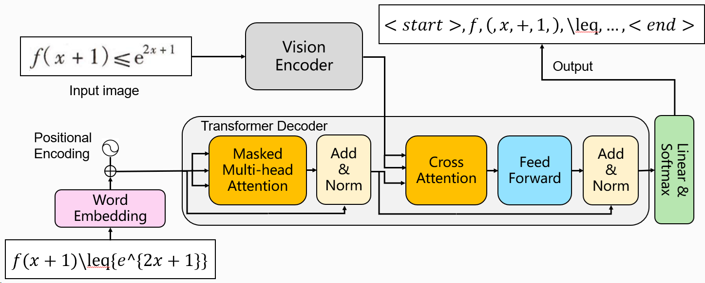

# math2latex

A text and mathematical formula hybrid recognizer

## Model Architecture

**Math2LaTeX** uses resnet18 to extract image features and transformer for LaTeX generation.



**Masked Language Modeling(MLM)** can helps the model improve its context understanding.


## How to use?

First, download the datasets in the `dataset` dir, and modify the dir name:

```
├── dataset
│   ├── data_mix
│   │   ├── dev
│   │   ├── test
│   │   ├── train
│   │   ├── dev_ids.txt
│   │   ├── test_ids.txt
│   │   └── train_ids.txt
│   └── data_pure
│       ├── dev
│       ├── test
│       ├── train
│       ├── dev_ids.txt
│       ├── test_ids.txt
│       └── train_ids.txt
│── checkpoints
│── data_preprocess
│── exp
│── img
│── layers
│── models
│── scripts
│── utils
│── vocab
│   ├── vocab_cn.txt
│   ├── vocab_plus_cn.txt
│   ├── vocab_plus.txt
│   └── vocab.txt
│── .gitignore
│── data_loader.py
│── main.py
│── README.md
│── requirements.txt
└── ui.py

```

Then install the requirements:

```sh
pip3 install requirements.txt
```

If you want to train the model:

```sh
python -u main.py \
    --task "pure" \ # options: ["pure", "mix"]
    --batch_size 64 \
    --n_epochs 30 \
    --lr 0.001 \
    --model "ResnetTransformer" \ 
    --dim 256 \
    --n_layers 3 \
    --n_heads 4 \
    --img_size 224 \
    --dropout 0.2 \
    --seed 2023 
```

or run the script:

```sh
nohup ./scripts/ResnetTransformer.py > log.txt &
```

Remember modify the settings like `batch_size` in `scripts/main.sh`

If you failed to run the script, maybe you should:

```sh
chmod -R 777 scripts/main.sh
```
